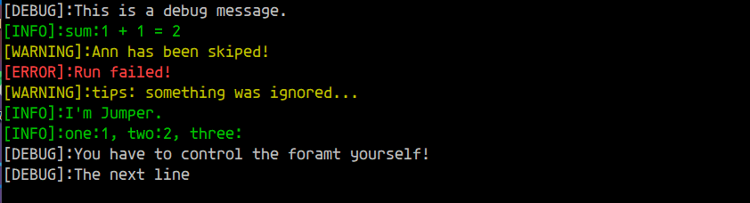

### 字符串格式化 jumper::format(...)函数

#### 用法

`format`函数依赖`Fmt`对象提供基础功能，首先介绍下`Fmt`类:

> `Fmt`是一个解析指定格式生成最终的格式串，根据配对的 __'{'__ 和 __'}'__ 分割格式串，最终`format`根据参数依次拼接输出。
>
> `Fmt`有两种构造方式：
>
> 1. 直接指定一个格式字符串，`Fmt fmt("a = {}");`
> 2. 先构造空对象，再设置格式，`Fmt fmt;fmt.set_fmt("a = {}");`
>
> 事实上，`Fmt`对象随时都可以调用`set_fmt`修改格式。还可以使用 __+__ 或者 __+=__ 拼接两个`Fmt`对象，就像拼接两个字符串一样。
>
> __在构造`Fmt`对象之后，请务必调用`is_ok()`来检查格式是否解析成功，解析失败`Fmt`对象将持有一个空的格式。__

我们可以通过创建一个`Fmt`对象来包含我们需要的格式，然后作为参数传递给`format`，更常见的情况是，我们直接使用字符串作为格式参数：

```c++
std::string str(jumper::format("{} + {} = {}", 1, 1, 1+1));

EXPECT_EQ(str, "1 + 1 = 2");
```

当然也可以：

```c++
Fmt fmt("5 - {}");

fmt += " = {}";
std::string str(jumper::format(fmt, 2, 5-2));

EXPECT_EQ(str, "5 - 2 = 3");
```

传入的参数数量可以比格式符多，多余的参数将被忽略：

```c++
auto str(jumper::format("one is {}, two is {}.", 1, 2, 3, 4, 5));

EXPECT_EQ(str, "one is 1, two is 2.");
```

但是不允许格式符的数量比参数多，这将会返回一个空字符串：

```c++
auto str(jumper::format("one is {}, two is {}.", 1));

EXPECT_TRUE(str.empty()); // str is an empty string!
```

__<span style="color:red"> 另外需要注意的一点是，`format`函数可以格式化的参数，必须是重载了<<运算符的对象。</span>__

另外，建议使用 `jumper::format(...)`而不是这样：

```c++
using jumper::format;

std::string str(format(...));
```

因为`C++20`标准新增了`<format>`库 [<https://zh.cppreference.com/w/cpp/header/format>]，其中也有`format`函数，但标准库的功能更加强大，为了防止潜在的命名冲突，建议明确指定作用域。

且`C++20`推广使用还需要一段时间，目前各家编译器对`<format>`支持也很差。可以使用这个库作为有限场景的替代。

Github：<https://github.com/DapengSusu/jformat>


#### 扩展

基于`jumper::format(...)`的衍生产物：简易日志工具`LogTracer`，提供一系列静态方法控制日志输出，支持`Debug`、`Info`、`Warning`、`Error`四种基本日志级别，可随时改变日志级别，在将log输出到终端的同时，也会将log写入指定的文件（也可以不写，可自行控制）。

请看以下示例：

```c++
// 如果不需要log文件，可省略
// LogTracer::InitialTracer(jumper::LV_DEBUG, "./logtracer.txt");
// 也可以单独设置log输出级别
LogTracer::SetLogLevel(jumper::LV_DEBUG);

// 注意，只有重载了<<运算符的对象才能直接作为输出参数
LogTracer::LoglnDebug("This is a debug message.");
LogTracer::LoglnInfo("sum:{} + {} = {}", 1, 1, 1+1);
LogTracer::LoglnWarning("{} has been skiped!", "Ann");
LogTracer::LoglnError("Run failed!");

// 格式语句中，必须是成对匹配的"{}"，其中间的内容将被忽略
LogTracer::LoglnWarning("tips: {ignored xxx}", "something was ignored...");

// 错误！格式符不匹配，这将会返回一个空字符串！
// LogTracer::LoglnError("No matched bracket:{}, then }", '{');

// 注意：允许参数比格式符多，多余的参数将被忽略
LogTracer::LoglnInfo("I'm {}.", "Jumper", 24);
LogTracer::LoglnInfo("one:{}, two:{}, three:", 1, 2, 3, 4, 5);

// 错误！不允许格式符比参数多，这将会返回一个空字符串！
// LogTracer::LoglnInfo("{} + {} = {}", 5);

// 不带ln的版本，不会自动插入换行符'\n'，需要自己控制格式，否则log会挤在一行
LogTracer::LogDebug("You have to control the foramt yourself!\n");
LogTracer::LogDebug("The next line\n");

// 改变log输出级别
LogTracer::SetLogLevel(jumper::LV_INFO);

// log级别低于当前设置的log级别，将不再输出显示（也不会被写入文件记录！）
LogTracer::LoglnDebug("You can NOT see me! hahaha");

// 注意，不能多个线程向同一个文件写入，可能会导致文件内容格式混乱！
```

终端输出：



